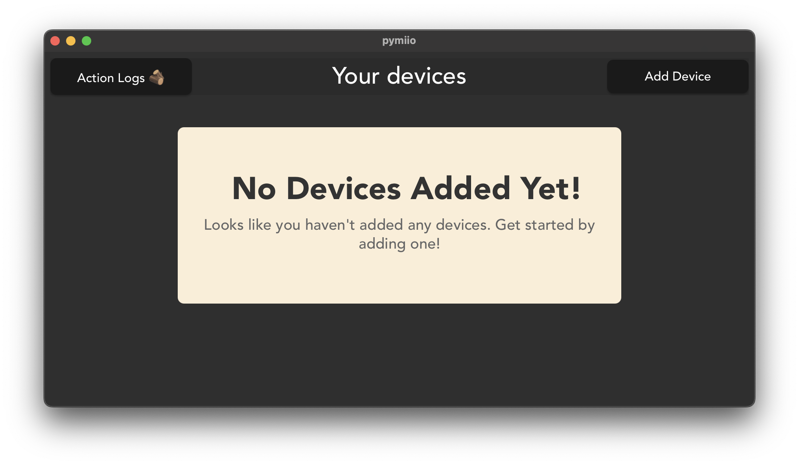
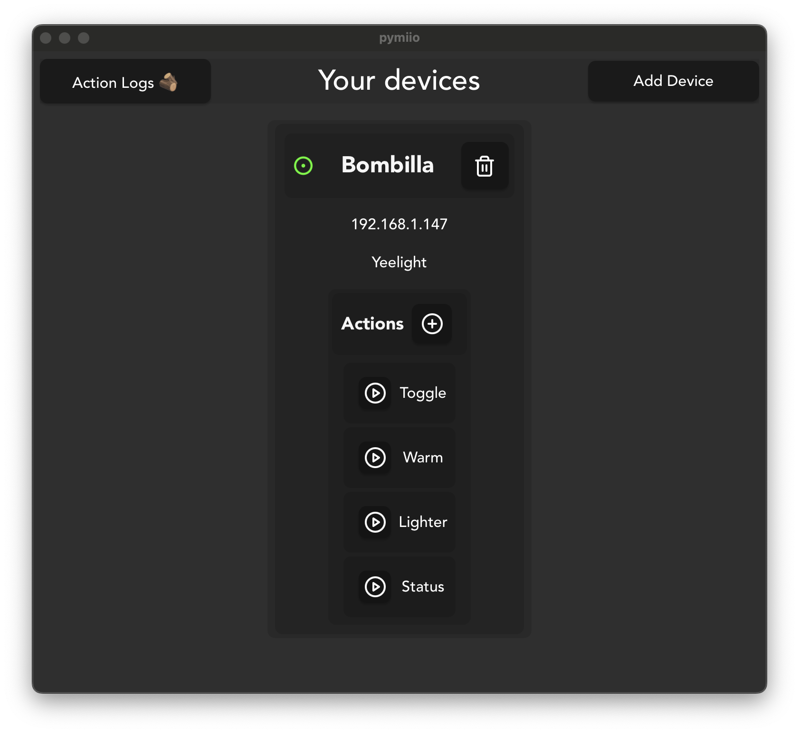

# PyMiio

PyMiio is a work-in-progress UI for managing and interacting with Miio devices using Tauri and Rust on the backend, and React with TypeScript on the frontend.

## Overview

This application provides the following features:
- **Device Management:** Add, remove, and list devices.
- **Action Control:** Configure and run actions on connected devices.
- **Tauri Integration:** Uses Tauri for a native desktop experience with a Rust backend.

> **Note:** The project is still in early development; many features are not fully implemented.

## Dependencies

This project depends mostly on the following libraries:
- [**rust-py-miio:**](https://github.com/juancabe/rust-py-miio) A Rust library that provides the bindings with the Python library
`python-miio`.
- **tauri:** A Rust library for building desktop applications with web technologies.
- **react:** A JavaScript library for building user interfaces.
- **typescript:** A superset of JavaScript that adds static typing to the language.


## Building the Project

- **rust-py-miio:** will use by default the Python interpreter available in your PATH and try to link with its dynamic library.
You can modify the `package.json` file to compile it so that it uses a different Python interpreter.
I needed to use that on **MacOS** because the default Python interpreter doesn't provide dynamically linkable libraries.
``` json
"tauri": "cross-env PYO3_PYTHON=yourversion tauri"
```
- Then you need the following Python packages:
```shell
$ pip install python-miio
$ pip install pyo3
```

- **tauri:** You can build the project using the following command:
```shell
$ npm run tauri build
```

## Images of the Application


